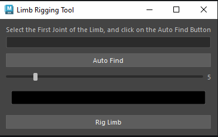

# Maya Plugins

his is a collection of maya plugins to help with rigging and other stuff

## Limb Rigger

Rigs any 3 joint limb.

* Auto find the joints
* Control the controller size
* control the controller color
* modular aproach
* After finding the joints and picking the color, click 'Rig Limb' and the limb controls with your color will appear
* The "Set Color" button will override any selected controller's color, even after your limb was already rigged, and it will be set to that color of your controller until you change it again.

## Maya To UE Tool

Adds an entire root joint, puts meshes into a list, and saves animations   

* Sets the root joint you selected
* Adds a new root joint by clicking Add Root Joint
* Adds any mesh into the list it shows in the middle of the window by clicking Add Meshes
* The Add Animation Clip will save you animations
