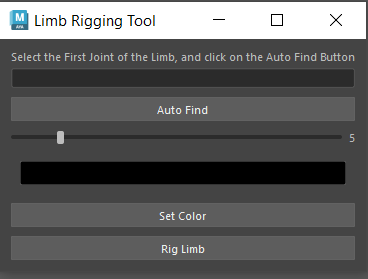

# Maya Plugins

his is a collection of maya plugins to help with rigging and other stuff

# How to Install:
drag the install.mel file into maya's viewport, and the tools will apear on the current shelf.

## Auto Space Switch (for parenting objects)

Parents the object to however many joints you wish along with switching between those joints.

* Select any object you want to parent to the joints and its name will pop up.
* Turn on the character's rig visibility and select the wrist joints and/or any other joint you want to parent the object to.
* You can parent the object to however many joints you want on the rig just by clicking "Select Switch Targets" button (make sure you are not still Alt+clicking the object while clicking the joints, the "Object to Switch" section will hold and remeber the object).
* Whenever you want to switch the object to the other joint, there is a group name that appears after you parent the joints to the object called "YourObject _dual_parent_grp". when you click that group you should see a section called "Space", that contains all the joints you've parented to your object, you just click on that section and switch to any joints you wish.

## Limb Rigger

Rigs any 3 joint limb.

* Auto find the joints
* Control the controller size
* control the controller color
* modular aproach
* After finding the joints and picking the color, click 'Rig Limb' and the limb controls with your color will appear
* The "Set Color" button will override any selected controller's color, even after your limb was already rigged, and it will be set to that color of your controller until you change it again.

## Maya To UE Tool

Adds an entire root joint, puts meshes into a list, and saves animations   

* Sets the root joint you selected
* Adds a new root joint by clicking Add Root Joint
* Adds any mesh into the list it shows in the middle of the window by clicking Add Meshes
* The Add Animation Clip will save you animations
